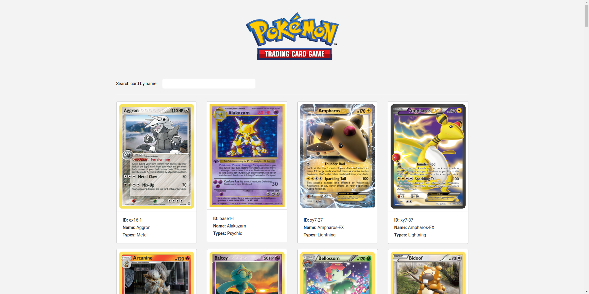

<h1 align="center">
    
    <br>
    Pokémon TCG React
</h1>
<h4 align="center">
  Practical frontend test for <a href="https://www1.brasilprev.com.br/" target="_blank">BrasilPrev</a>
</h4>

<p align="center">
  

  

  

  <a href="https://github.com/douglasdeoliveira/pokemon-tcg-react/commits/master">
    
  </a>

  <a href="https://github.com/douglasdeoliveira/pokemon-tcg-react/issues">
    
  </a>

  
</p>

<p align="center">
  <a href="#rocket-technologies">Technologies</a>&nbsp;&nbsp;&nbsp;|&nbsp;&nbsp;&nbsp;
  <a href="#information_source-how-to-use">How To Use</a>&nbsp;&nbsp;&nbsp;|&nbsp;&nbsp;&nbsp;
  <a href="#memo-license">License</a>
</p>



## :rocket: Technologies

This project was developed with the following technologies:

- [ReactJS](https://reactjs.org/)
- [React router](https://reacttraining.com/react-router/)
- [Axios](https://github.com/axios/axios)
- [Styled Components](https://react.i18next.com/)
- [Flexboxgrid](http://flexboxgrid.com/)
- [Eslint](https://eslint.org/)
- [Husky](https://github.com/typicode/husky)
- [Prettier](https://prettier.io/)
- [Stylelint](https://stylelint.io/)

## :information_source: How To Use

To clone and run this application, you'll need [Git](https://git-scm.com), [Node.js v10.16][nodejs] or higher + [Yarn v1.13][yarn] or higher installed on your computer. From your command line:

```bash
# Clone this repository
$ git clone https://github.com/douglasdeoliveira/pokemon-tcg-react

# Install dependencies
$ cd pokemon-tcg-react && yarn

# Run frontend
$ yarn start
```

## :memo: License

This project is under the MIT license. See the [LICENSE](https://github.com/douglasdeoliveira/pokemon-tcg-react/blob/master/LICENSE) for more information.

---

Made with ♥ by Douglas de Oliveira :wave: [Get in touch!](https://www.linkedin.com/in/douglasoliveiraa/)

[nodejs]: https://nodejs.org/
[yarn]: https://yarnpkg.com/
